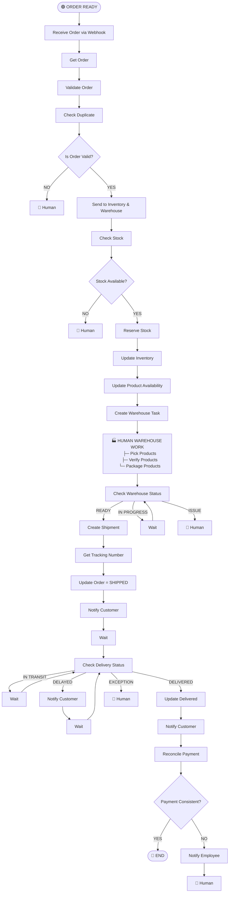

# Order Processing Flow

```mermaid
flowchart TD
    A([🟢 ORDER READY]) --> B[Receive Order via Webhook]
    B --> C[Get Order]
    C --> D[Validate Order]
    D --> E[Check Duplicate]
    E --> F{Is Order Valid?}

    F -- NO --> H1[👤 Human]
    F -- YES --> G[Send to Inventory & Warehouse]

    G --> I[Check Stock]
    I --> J{Stock Available?}

    J -- NO --> H2[👤 Human]
    J -- YES --> K[Reserve Stock]

    K --> L[Update Inventory]
    L --> M[Update Product Availability]
    M --> N[Create Warehouse Task]

    N --> O["🏭 HUMAN WAREHOUSE WORK
    ├─ Pick Products
    ├─ Verify Products
    └─ Package Products"]

    O --> P[Check Warehouse Status]

    P -- READY --> Q[Create Shipment]
    P -- IN PROGRESS --> R[Wait] --> P
    P -- ISSUE --> H3[👤 Human]

    Q --> S[Get Tracking Number]
    S --> T[Update Order = SHIPPED]
    T --> U[Notify Customer]
    U --> V[Wait]
    V --> W[Check Delivery Status]

    W -- IN TRANSIT --> X[Wait] --> W
    W -- DELAYED --> Y[Notify Customer] --> Z[Wait] --> W
    W -- DELIVERED --> AA[Update Delivered]
    W -- EXCEPTION --> H4[👤 Human]

    AA --> AB[Notify Customer]
    AB --> AC[Reconcile Payment]
    AC --> AD{Payment Consistent?}

    AD -- YES --> AE([🔴 END])
    AD -- NO --> AF[Notify Employee]
    AF --> H5[👤 Human]
```
